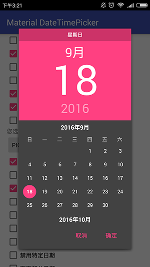

# MaterialDateTimePicker
 
 
 
 
 
## apk
[MaterialDateTimePicker-1.0.1-sample.apk](https://github.com/Sing1/MaterialDateTimePicker/blob/master/app.apk)
## gradle:
```groovy
dependencies {
    ...
    compile 'sing.materialdatetimepicker:library:1.0.1'
}
```
## Maven:
```xml
<dependency>
  <groupId>sing.materialdatetimepicker</groupId>
  <artifactId>library</artifactId>
  <version>1.0.1</version>
  <type>aar</type>
</dependency>
```
## sample 
```JAVA
package sing.datetimepicker;


import android.content.DialogInterface;
import android.graphics.Color;
import android.os.Bundle;
import android.support.v7.app.AppCompatActivity;
import android.util.Log;
import android.view.View;
import android.widget.CheckBox;
import android.widget.TextView;

import com.sing.datetimepicker.Utils;
import com.sing.datetimepicker.date.DatePickerDialog;
import com.sing.datetimepicker.time.RadialPickerLayout;
import com.sing.datetimepicker.time.TimePickerDialog;

import java.util.Calendar;

public class MainActivity extends AppCompatActivity implements
        View.OnClickListener,
        TimePickerDialog.OnTimeSetListener,
        DatePickerDialog.OnDateSetListener {
    private TextView timeTextView;
    private TextView dateTextView;
    private CheckBox mode24Hours;
    private CheckBox modeDarkTime;
    private CheckBox modeDarkDate;
    private CheckBox modeCustomAccentTime;
    private CheckBox modeCustomAccentDate;
    private CheckBox vibrateTime;
    private CheckBox vibrateDate;
    private CheckBox dismissTime;
    private CheckBox dismissDate;
    private CheckBox titleTime;
    private CheckBox titleDate;
    private CheckBox showYearFirst;
    private CheckBox enableSeconds;
    private CheckBox enableMinutes;
    private CheckBox limitTimes;
    private CheckBox limitDates;
    private CheckBox disableDates;
    private CheckBox highlightDates;

    @Override
    protected void onCreate(Bundle savedInstanceState) {
        super.onCreate(savedInstanceState);
        setContentView(R.layout.activity_main);

        timeTextView = (TextView) findViewById(R.id.time_textview);
        dateTextView = (TextView) findViewById(R.id.date_textview);
        mode24Hours = (CheckBox) findViewById(R.id.mode_24_hours);
        modeDarkTime = (CheckBox) findViewById(R.id.mode_dark_time);
        modeDarkDate = (CheckBox) findViewById(R.id.mode_dark_date);
        modeCustomAccentTime = (CheckBox) findViewById(R.id.mode_custom_accent_time);
        modeCustomAccentDate = (CheckBox) findViewById(R.id.mode_custom_accent_date);
        vibrateTime = (CheckBox) findViewById(R.id.vibrate_time);
        vibrateDate = (CheckBox) findViewById(R.id.vibrate_date);
        dismissTime = (CheckBox) findViewById(R.id.dismiss_time);
        dismissDate = (CheckBox) findViewById(R.id.dismiss_date);
        titleTime = (CheckBox) findViewById(R.id.title_time);
        titleDate = (CheckBox) findViewById(R.id.title_date);
        showYearFirst = (CheckBox) findViewById(R.id.show_year_first);
        enableSeconds = (CheckBox) findViewById(R.id.enable_seconds);
        enableMinutes = (CheckBox) findViewById(R.id.enable_minutes);
        limitTimes = (CheckBox) findViewById(R.id.limit_times);
        limitDates = (CheckBox) findViewById(R.id.limit_dates);
        disableDates = (CheckBox) findViewById(R.id.disable_dates);
        highlightDates = (CheckBox) findViewById(R.id.highlight_dates);

        // Check if picker mode is specified in Style.xml
        modeDarkTime.setChecked(Utils.isDarkTheme(this, modeDarkTime.isChecked()));
        modeDarkDate.setChecked(Utils.isDarkTheme(this, modeDarkDate.isChecked()));

        // Ensure a consistent state between enableSeconds and enableMinutes
        enableMinutes.setOnClickListener(this);
        enableSeconds.setOnClickListener(this);
    }

    /**
     * 选择时间
     * @param v
     */
    public void timeButton(View v){
        Calendar now = Calendar.getInstance();
        TimePickerDialog tpd = TimePickerDialog.newInstance(
                MainActivity.this,
                now.get(Calendar.HOUR_OF_DAY),
                now.get(Calendar.MINUTE),
                mode24Hours.isChecked()
        );
        tpd.setThemeDark(modeDarkTime.isChecked());
        tpd.vibrate(vibrateTime.isChecked());
        tpd.dismissOnPause(dismissTime.isChecked());
        tpd.enableSeconds(enableSeconds.isChecked());
        tpd.enableMinutes(enableMinutes.isChecked());
        if (modeCustomAccentTime.isChecked()) {
            tpd.setAccentColor(Color.parseColor("#9C27B0"));
        }
        if (titleTime.isChecked()) {
            tpd.setTitle("TimePicker Title");
        }
        if (limitTimes.isChecked()) {
            tpd.setTimeInterval(2, 5, 10);
        }
        tpd.setOnCancelListener(new DialogInterface.OnCancelListener() {
            @Override
            public void onCancel(DialogInterface dialogInterface) {
                Log.d("TimePicker", "Dialog was cancelled");
            }
        });
        tpd.show(getFragmentManager(), "Timepickerdialog");
    }

    /**
     * 日期选择
     * @param v
     */
    public void dateButton(View v){
        Calendar now = Calendar.getInstance();
        DatePickerDialog dpd = DatePickerDialog.newInstance(
                MainActivity.this,
                now.get(Calendar.YEAR),
                now.get(Calendar.MONTH),
                now.get(Calendar.DAY_OF_MONTH)
        );
        dpd.setThemeDark(modeDarkDate.isChecked());
        dpd.vibrate(vibrateDate.isChecked());
        dpd.dismissOnPause(dismissDate.isChecked());
        dpd.showYearPickerFirst(showYearFirst.isChecked());
        if (modeCustomAccentDate.isChecked()) {
            dpd.setAccentColor(Color.parseColor("#9C27B0"));
        }
        if (titleDate.isChecked()) {
            dpd.setTitle("DatePicker Title");
        }
        if (limitDates.isChecked()) {
            Calendar[] dates = new Calendar[13];
            for (int i = -6; i <= 6; i++) {
                Calendar date = Calendar.getInstance();
                date.add(Calendar.MONTH, i);
                dates[i + 6] = date;
            }
            dpd.setSelectableDays(dates);
        }
        if (highlightDates.isChecked()) {
            Calendar[] dates = new Calendar[13];
            for (int i = -6; i <= 6; i++) {
                Calendar date = Calendar.getInstance();
                date.add(Calendar.WEEK_OF_YEAR, i);
                dates[i + 6] = date;
            }
            dpd.setHighlightedDays(dates);
        }
        if (disableDates.isChecked()) {
            Calendar[] dates = new Calendar[3];
            for (int i = -1; i <= 1; i++) {
                Calendar date = Calendar.getInstance();
                date.add(Calendar.DAY_OF_MONTH, i);
                dates[i + 1] = date;
            }
            dpd.setDisabledDays(dates);
        }
        dpd.show(getFragmentManager(), "Datepickerdialog");
    }

    @Override
    public void onClick(View view) {
        if (enableSeconds.isChecked() && view.getId() == R.id.enable_seconds)
            enableMinutes.setChecked(true);
        if (!enableMinutes.isChecked() && view.getId() == R.id.enable_minutes)
            enableSeconds.setChecked(false);
    }

    @Override
    public void onResume() {
        super.onResume();
        TimePickerDialog tpd = (TimePickerDialog) getFragmentManager().findFragmentByTag("Timepickerdialog");
        DatePickerDialog dpd = (DatePickerDialog) getFragmentManager().findFragmentByTag("Datepickerdialog");

        if (tpd != null) tpd.setOnTimeSetListener(this);
        if (dpd != null) dpd.setOnDateSetListener(this);
    }

    @Override
    public void onTimeSet(RadialPickerLayout view, int hourOfDay, int minute, int second) {
        String hourString = hourOfDay < 10 ? "0" + hourOfDay : "" + hourOfDay;
        String minuteString = minute < 10 ? "0" + minute : "" + minute;
        String secondString = second < 10 ? "0" + second : "" + second;
        String time = "选择的时间: " + hourString + ":" + minuteString + ":" + secondString;
        timeTextView.setText(time);
    }

    @Override
    public void onDateSet(DatePickerDialog view, int year, int monthOfYear, int dayOfMonth) {
        String date = "选择的日期: " + year + "-" + (++monthOfYear) + "-" + dayOfMonth;
        dateTextView.setText(date);
    }
}
```
